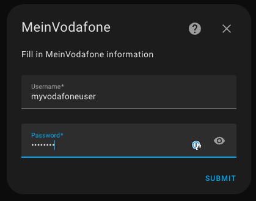
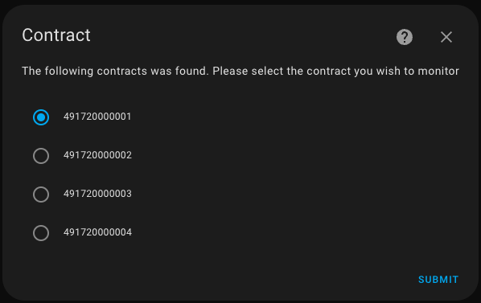
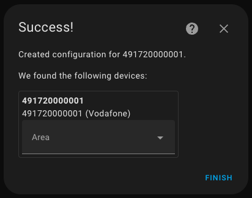
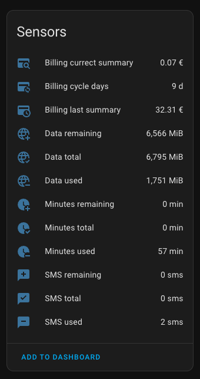

# MeinVodafone - Home Assistant Integration

## About this repo
I've developed this integration to monitor my children's data usage, ensuring they don't exceed their allotted limits.

This project enables the monitoring of your Vodafone DE mobile phone contract's Minutes/SMS/Data usage through Home Assistant.

I hope this integration will be helpful for you as well.

---

## Installation
I recommend installing it via [HACS](https://github.com/hacs/integration)

Currently, integration is not part of the HACS, so you will have to add the repository manually:
1. Go to HACS -> Integrations
2. Add this repo to your HACS custom repositories
3. Search for MeinVodafone and Download it
4. Restart your HomeAssistant

---

### Setup the Integration

1. Go to Settings -> Devices & Services
2. Shift reload your browser
3. Click Add Integration

4. Search for MeinVodafone 

5. Enter your username and password, press submit 

6. Select contract and press submit 

7. If you see this screen, your configuration is successful 

---

## IMPORTANT
- The retry mechanism has intentionally been omitted due to the sensitivity of the Vodafone servers.
- Multiple retries could result in a 24-hour block. 
- The data usage retrieval period is configured for every 15 minutes.
- Support for 2FA (two-factor authentication) is currently unavailable.
- If you're on a flat tariff, both your Total and Remaining sensors will display as 0.

---

## Functionality
- Minutes Used/Remaining/Total
- SMS Used/Remaining/Total
- Data Used/Remaining/Total
- Support for multiple packages (Primary/Secondary)
- Billing Summary Current/Previous.
- Billing Cycle (days left)

